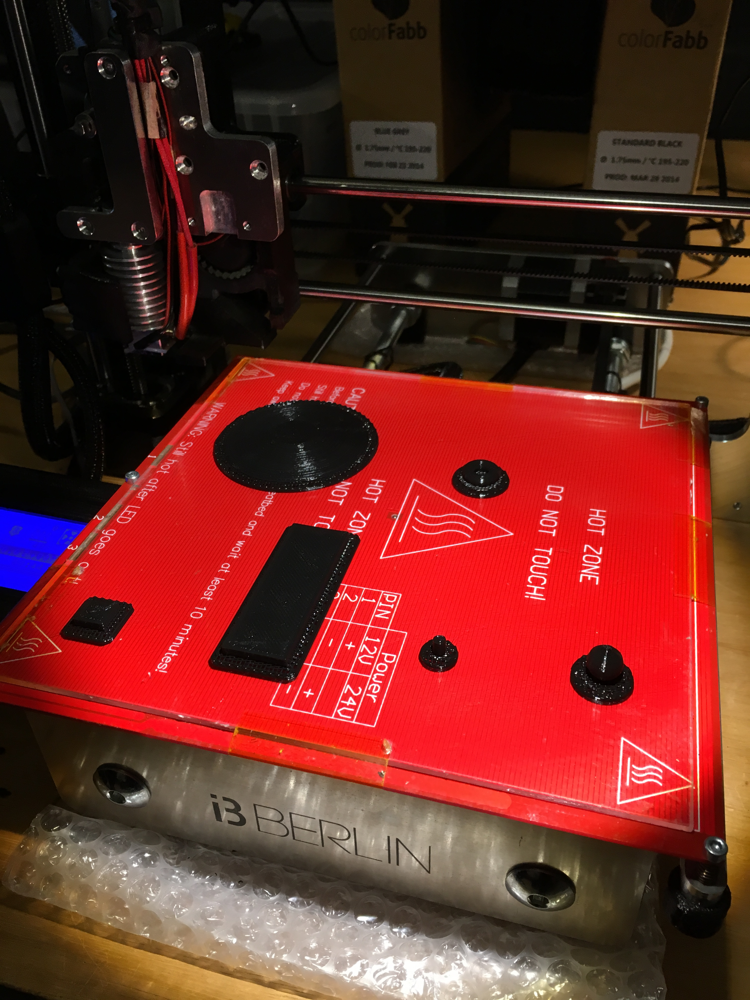
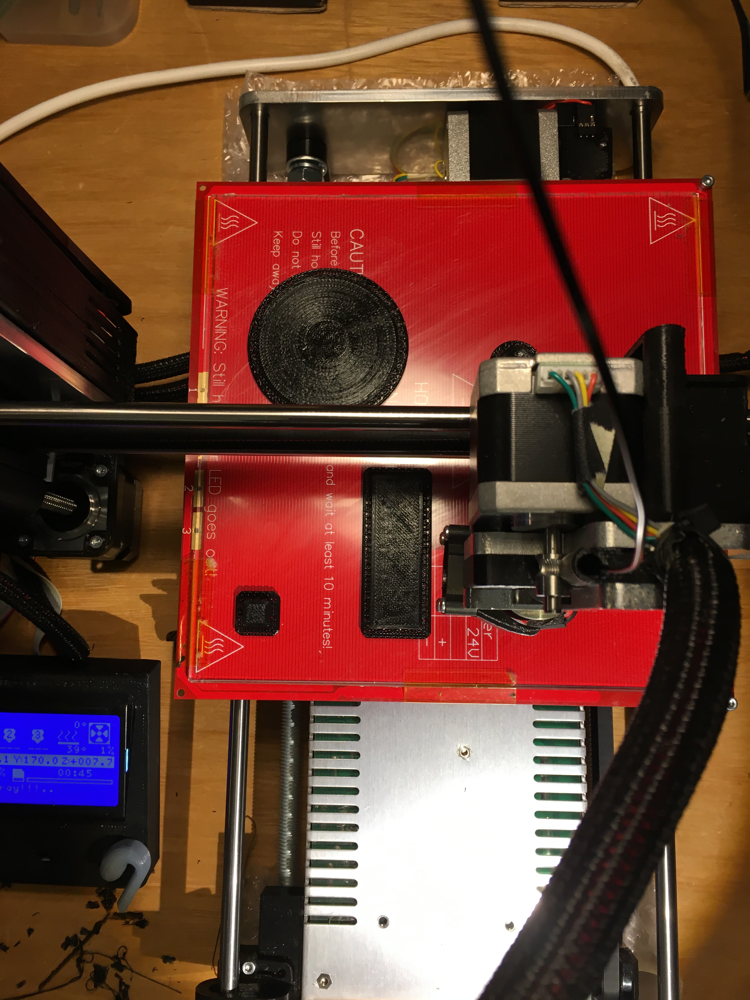
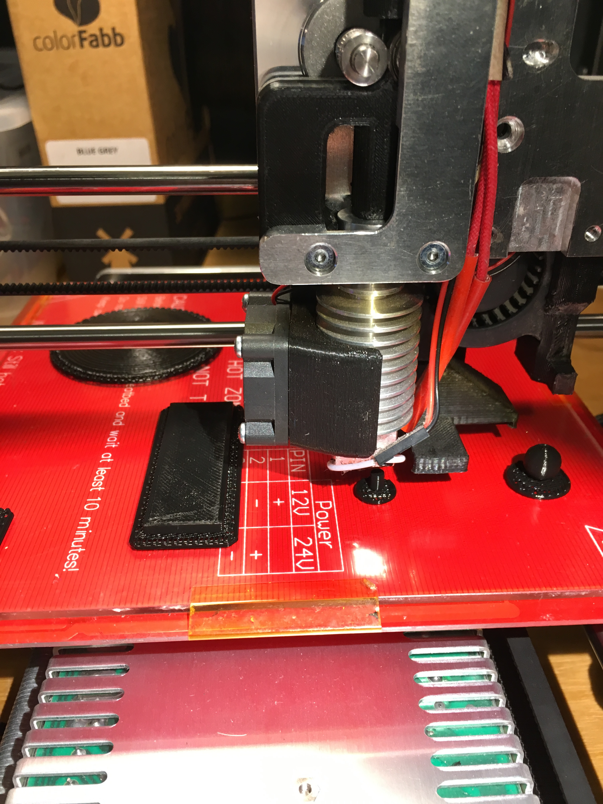

# Arrange Macro For FreeCAD

We want to serially print a number of objects on an i3-Berlin printer without having to
remove each object from the printer's plate after it's finished.
This macro will help with that.

## Serial Printing vs. Parallel Printing

The advantages of serial printing printing over parallel printing are the following:
* speed -- in parallel printing the print head prints all the objects at once and in each layer it has therefore
  to move between objects. Thus it takes more time to complete a parallel print of so and so many objects instead
  of printing them one after the other.
* robustness -- when we print in parallel, if one object isn't printed correctly and the print fails, all objects on the plates
  are usually lost. If we print the objects one after the other, this is not such a big deal, because we can just abort the print of the broken object and only one object is lost
* quality -- the fact that in parallel printing the extruder keeps moving between objects leads to inferior quality compared to
  sequential printing

## Some Pictures

